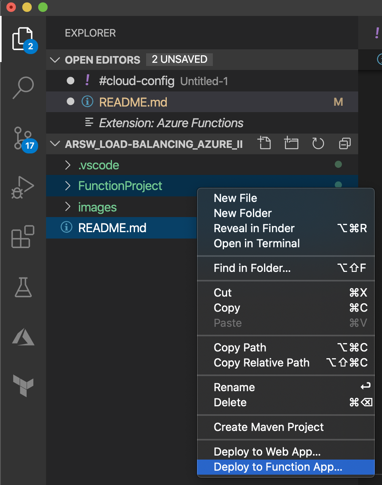
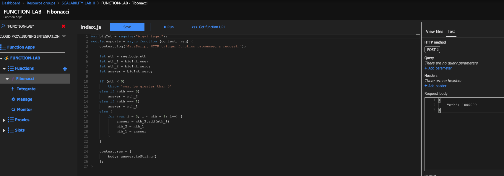

### Escuela Colombiana de Ingeniería
### Arquitecturas de Software - ARSW

## Escalamiento en Azure con Maquinas Virtuales, Sacale Sets y Service Plans

### Dependencias
* Cree una cuenta gratuita dentro de Azure. Para hacerlo puede guiarse de esta [documentación](https://azure.microsoft.com/en-us/free/search/?&ef_id=Cj0KCQiA2ITuBRDkARIsAMK9Q7MuvuTqIfK15LWfaM7bLL_QsBbC5XhJJezUbcfx-qAnfPjH568chTMaAkAsEALw_wcB:G:s&OCID=AID2000068_SEM_alOkB9ZE&MarinID=alOkB9ZE_368060503322_%2Bazure_b_c__79187603991_kwd-23159435208&lnkd=Google_Azure_Brand&dclid=CjgKEAiA2ITuBRDchty8lqPlzS4SJAC3x4k1mAxU7XNhWdOSESfffUnMNjLWcAIuikQnj3C4U8xRG_D_BwE). Al hacerlo usted contará con $200 USD para gastar durante 1 mes.

### Parte 0 - Entendiendo el escenario de calidad

Adjunto a este laboratorio usted podrá encontrar una aplicación totalmente desarrollada que tiene como objetivo calcular el enésimo valor de la secuencia de Fibonnaci.

**Escalabilidad**
Cuando un conjunto de usuarios consulta un enésimo número (superior a 1000000) de la secuencia de Fibonacci de forma concurrente y el sistema se encuentra bajo condiciones normales de operación, todas las peticiones deben ser respondidas y el consumo de CPU del sistema no puede superar el 70%.

### Escalabilidad Serverless (Functions)

1. Cree una Function App tal cual como se muestra en las  imagenes.

2. Instale la extensión de **Azure Functions** para Visual Studio Code.

3. Despliegue la Function de Fibonacci a Azure usando Visual Studio Code. La primera vez que lo haga se le va a pedir autenticarse, siga las instrucciones.

4. Dirijase al portal de Azure y pruebe la function.

5. Modifique la coleción de POSTMAN con NEWMAN de tal forma que pueda enviar 10 peticiones concurrentes. Verifique los resultados y presente un informe.

Podemos ver que todas las peticiones tuvieron un resultado exitoso.

### Conclusiones

 * Todas las peticiones fueron respondidas satisfactoriamente.
 * Al desplegar esta solucion utilizando un modelo serverless se obtuvieron resultados satisfactorios esto a pesar de eser una solucion ineficiente, demostrando la efectividad de una solucion serverless usando Azure Functions.

6. Cree una nueva Function que resuleva el problema de Fibonacci pero esta vez utilice un enfoque recursivo con memoization. Pruebe la función varias veces, después no haga nada por al menos 5 minutos. Pruebe la función de nuevo con los valores anteriores. ¿Cuál es el comportamiento?.

Se probaron dos escenarios, en el primero se calculó el 1000 nesimo numero y en el segundo el 10000 nesimo.

#### Primer escenario

#### Segundo escenario

Podemos ver que en el primer escenario todas las peticiones fueron exitosas mientras que en el segundo escenario todas las peticiones fallaron debido a los limites de la recursion. Ademas, con este nuevo enforque los tiempos de respuesta reducieron bastante.

**Preguntas**

* ¿Qué es un Azure Function?

Azure Functions es una experiencia de procesamiento bajo demanda impulsada por eventos que amplía la plataforma de aplicaciones de Azure existente con capacidades para implementar código desencadenado por eventos que ocurren en Azure o en servicios de terceros, así como en sistemas locales. 

* ¿Qué es serverless?

La computación sin servidor es un modelo de ejecución de computación en la nube en el que el proveedor de la nube ejecuta el servidor y administra dinámicamente la asignación de recursos de la máquina.

* ¿Qué es el runtime y que implica seleccionarlo al momento de crear el Function App?

Azure Functions Runtime proporciona una forma de experimentar Azure Functions antes de comprometerse con la nube. El tiempo de ejecución abre nuevas opciones, como el uso de la potencia de cálculo de repuesto de las computadoras locales para ejecutar procesos por lotes durante la noche. También permite usar  dispositivos dentro de la organización para enviar datos condicionalmente a otros sistemas, tanto en las instalaciones como en la nube.
La selección del runtime permite que los activos de código que se crean se puedan llevar a la nube cuando se realice la migración.

* ¿Por qué es necesario crear un Storage Account de la mano de un Function App?

Es necesario ya que Azure Functions se basa en Azure Storage para operaciones como la administración de desencadenadores y el registro de ejecuciones de funciones.

* ¿Cuáles son los tipos de planes para un Function App?, ¿En qué se diferencias?, mencione ventajas y desventajas de cada uno de ellos.

**Plan de consumo**

Este plan permite que las instancias del host de Azure Functions se agregan y quitan dinámicamente según la cantidad de eventos entrantes. 
El plan de consumo es el plan de alojamiento predeterminado y ofrece los siguientes beneficios:

 * Solo se paga solo cuando las funciones se estén ejecutando
 * Se escala automáticamente, incluso durante períodos de alta carga
 
**Plan premium**

Este plan permite que las instancias del host de Azure Functions se agreguen y eliminen en función del número de eventos entrantes, al igual que el plan de consumo.
El plan premium tiene los siguientes beneficios:

   * Instancias perpetuamente calientes para evitar cualquier arranque en frío
   * Conectividad de red virtual
   * Duración de ejecución ilimitada (60 minutos garantizados)
   * Tamaños de instancia premium (instancias de un núcleo, dos núcleos y cuatro núcleos)
   * Precios más predecibles
   * Asignación de aplicaciones de alta densidad para planes con aplicaciones de múltiples funciones
 
**Plan dedicado**

   Permite que las aplicaciones de función también puedan ejecutarse en las mismas máquinas virtuales dedicadas que otras aplicaciones de App Service (SKU básicas, estándar,        premium y aisladas).

   Posee los siguientes beneficios: 
   
   -Permite escalar horizontalmente agregando más instancias de VM. 
   
   -Es posible habilitar la escala automática.

* ¿Por qué la memoization falla o no funciona de forma correcta?

Ocurren problemas en la recursión con números muy grandes. De esta manera , sucede un  desbordamiento de la pila que causa que se agote el espacio de memoria de la misma.

* ¿Cómo funciona el sistema de facturación de las Function App?

El plan de consumo de Azure Functions se factura en función del consumo de recursos y las ejecuciones por segundo. Los precios del plan de consumo incluyen una concesión gratuita mensual de 1 millones de solicitudes y 400.000 GB-segundos de consumo de recursos por suscripción en el modelo de precios de pago por uso, para todas las aplicaciones de funciones de esa suscripción.
El plan Azure Functions Premium proporciona un rendimiento mejorado y se factura por segundo en función del número de vCPU/s y de GB/s que consuman sus funciones premium. Los clientes también pueden ejecutar Functions dentro de su plan de App Service a las tarifas normales del plan de App Service.

* Informe
